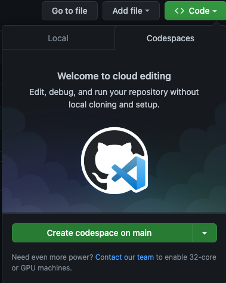

# Technical Test - Full-Stack

## Setup

Before starting, you should Clone or [fork the repo](https://docs.github.com/en/free-pro-team@latest/github/getting-started-with-github/fork-a-repo). If forking, it is **highly recommended** to [create a private fork](https://stackoverflow.com/a/30352360).

> **Note**: For an experimental but quicker setup, we've added a config for devcontainers which you can use. If you would like to try it, skip to the [Setup using devcontainers](#optional-setup-using-devcontainers) section.

## Setup natively
1. Download and install .NET Core.

>https://dotnet.microsoft.com/download

2. Download VSCode or an IDE of your choice.

3. Open the root folder (or the solution file depending on your IDE).

4. Run the project.
```shell
dotnet run -p src/TechnicalTest.Project
```

You can make HTTP calls using curl
```shell
curl http://localhost:5000/home
```

Or using an HTTP client of your choice.

6. Code away!
---

## (Optional) Setup using devcontainers

Devcontainers are a really neat feature from VS Code which allows your development environment (dependencies) to be containerized.

### Using Github Codespaces
If you have a Github premium membership, you can simply open this repository in a codespace:



### Using Docker
1. Install [Docker](https://docs.docker.com/get-docker/)

2. Open this folder in VS Code (bash `code .`)

3. Install the [recommended extensions](./.vscode/extensions.json)

4. **Important**: if you are on arm64 (i.e. M1 Macs), modify the `build.args.VARIANT` variable to `"VARIANT": "3.1-buster-arm64v8"` in [.devcontainer/devcontainer.json](./.devcontainer/devcontainer.json)

5. Open the folder in the devcontainer using either the prompt in the bottom right corner or launching the `Remote-Containers: Rebuild and Reopen in Container` command in the palette (Cmd/Control + Shift + P)

**Prompt for reference:**


6. You should not be able to run & debug the project pressing F5 ([.NET Core Launch (web)](./.vscode/launch.json))
 
## What to do

### 1. Accessing the data
Based on the domain, you must create at least one repository in order to access the data. Repository(ies) should implement the `IRepository<T>` interface from `/src/TechnicalTest/Infrastructure/Repositories`.

### 2. Use LINQ and LINQ extension methods
Now that you have repositories, you must add a new methods to the `IRepository<T>` interface and implement them.

The new methods should allow :
- To get a specific entity while including all its relationships and nested relationships.
- To list multiple entities using paging parameters
- To get a count of entities respecting a certain condition

### 3. Polymorphism
In addition to our domain entities, our API should be able to manipulate `Modality`. Based on the `modalities.json` file in `/src/TechnicalTest/Stores/Data`, create a polymorphic class structure where a `Modality` can be either a `PaymentModality` or a `TreatmentModality`. 

Modalities should be accessible using the already implemented generic `ReadAll` method in the `GenericStore`.

### 4. Make it an API
Now that the basics are down, you need to expose all of this through an API that should allow to :

- Get, List, Create, Update, Delete all types of entities in the domain.
- List all `Modality`

This step is purposely vague. Show us how you would go about this!


